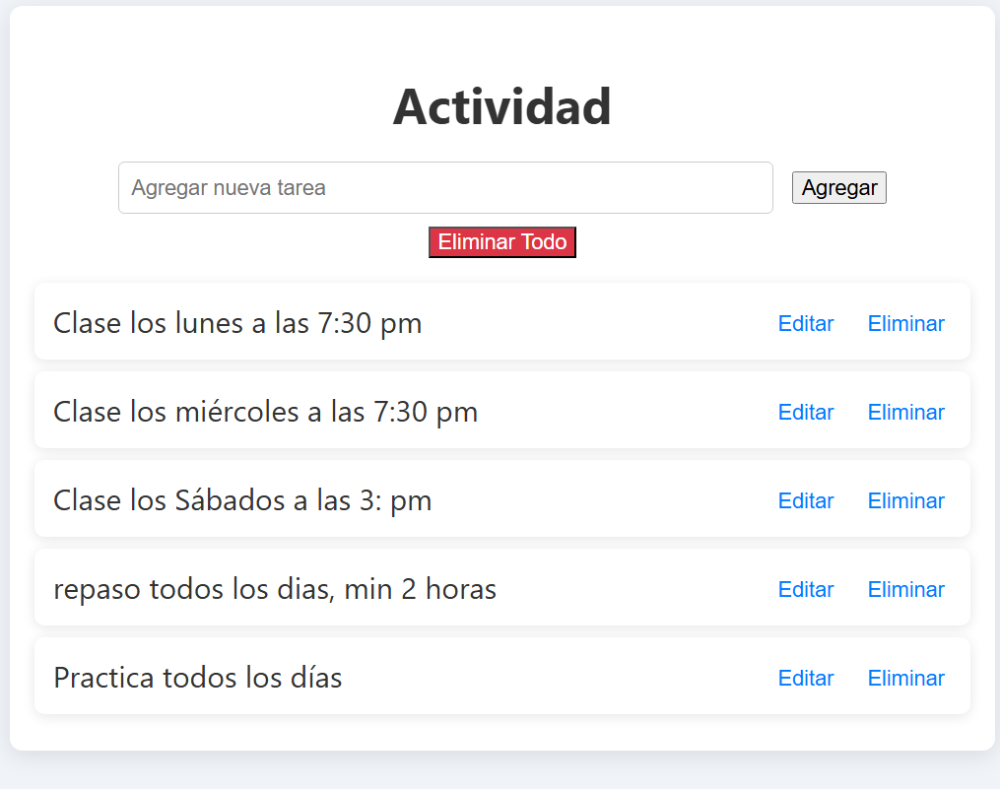
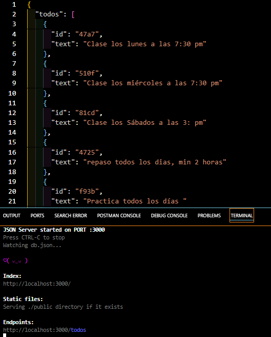
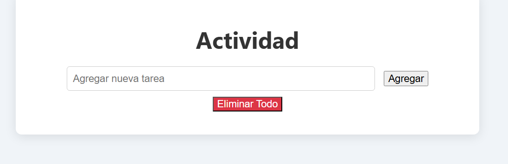
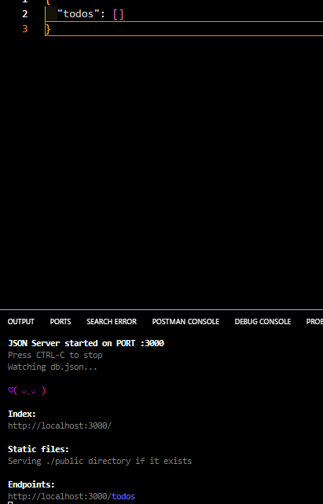

# Proyecto ToDo con API REST

Este proyecto es una aplicación APP que utiliza `json-server` para almacenar y gestionar las tareas a través de una API REST.

## Instalación

1. Clona el repositorio.
2. Navega a la carpeta del proyecto.
3. Ejecuta `npm install` para instalar las dependencias.
4. Inicia el servidor JSON con `npm start`.

## Uso

- Puedes agregar tareas a la lista.
- Las tareas se almacenarán en `db.json` y se recuperarán a través de la API REST.

## Captura de Pantalla

- La aplicación APP mostrará una lista de tareas y permitirá agregar nuevas tareas.

- Se muestran las tareas en el arch. `db.json`

- Elimina las tareas de la Pantalla

- Elimina las tareas en el arch. db.json

